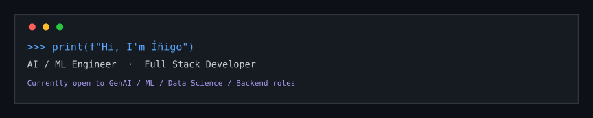
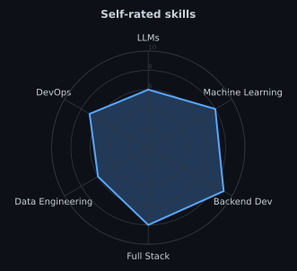
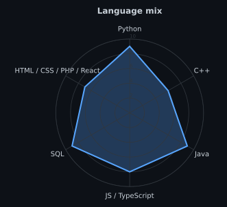
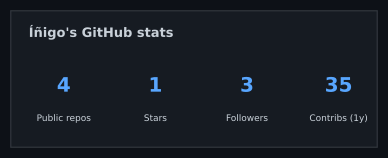
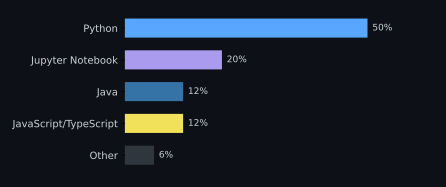

<!-- BANNER - generated by scripts/generate_assets.py from skills.json/langmix.json/stats.json. Edit the data, re-run the script, recommit. -->
<picture>
  <source media="(prefers-color-scheme: dark)" srcset="assets/banner-dark.svg">
  <source media="(prefers-color-scheme: light)" srcset="assets/banner-light.svg">
  
</picture>

 

 

&nbsp;&nbsp;
&nbsp;&nbsp;

  

---

## 🙋 About me

I'm **Íñigo Fernández Barrill**, a software engineer from Pamplona, Spain, specialized in **AI / Machine Learning** and **Full Stack** development.

- 💼 I worked as a **Full Stack Software Developer at [Orisha Commerce](https://www.orisha-commerce.com/) (Openbravo)**, Mutilva (Navarra), from September 2023 to March 2026.
- 🔬 Before that, I was a **research intern at [Veridas Digital Authentication Solutions](https://veridas.com/)** (Noáin, Navarra), across two periods between 2021 and 2022.
- 🎓 **Master's Degree in Data Science and Machine Learning** — University of La Rioja (2022–2023). My thesis applied Multi-Task Learning to breast cancer detection in mammographies → [`CancerDetection`](https://github.com/inigo99/CancerDetection).
- 🎓 **Computer Engineering Degree**, specialization in Computing/AI — Public University of Navarre (2017–2022).
- 🌍 Spanish (native) · English (C1) · French (B1).
- 🚀 **Currently looking for opportunities** as a **GenAI, Machine Learning, Data Science or Backend (Python) Engineer**. If you have something that could be a fit, let's talk!

 

## 🛠️ Stack

**AI / ML:** PyTorch · FastAI · Timm · scikit-learn · Pandas · NumPy
**Backend / Full Stack:** Python · Java · Node.js · FastAPI · Flask · JavaScript / TypeScript · HTML / CSS · React
**Data & infrastructure:** PostgreSQL · MySQL · MongoDB · Docker · Git

 

## 📡 Signals

<table>
<tr>
<td width="50%" align="center" valign="middle">

<!-- Self-rated radar - edit skills.json, then run generate_assets.py -->
<picture>
  <source media="(prefers-color-scheme: dark)" srcset="assets/radar-dark.svg">
  <source media="(prefers-color-scheme: light)" srcset="assets/radar-light.svg">
  
</picture>

</td>
<td width="50%" align="center" valign="middle">

<!-- Language mix radar - edit langmix.json, then run generate_assets.py -->
<picture>
  <source media="(prefers-color-scheme: dark)" srcset="assets/radar-langs-dark.svg">
  <source media="(prefers-color-scheme: light)" srcset="assets/radar-langs-light.svg">
  
</picture>

</td>
</tr>
</table>

 

## 📌 Featured project

**[CancerDetection](https://github.com/inigo99/CancerDetection)** — Master's thesis: *Multi-Task Learning for Breast Cancer Detection in Mammographies*. Compares image models (ResNet, EfficientNet, ConvNeXt, HRNet, DeiT), classical tabular models, and two Multi-Task Learning architectures on the RSNA Screening Mammography (Kaggle) dataset.

 

## 📊 Numbers

<!-- Generated by generate_assets.py from stats.json into this repo. Deliberately not the shared
     github-readme-stats/streak-stats public instances: they're rate-limited across everyone using
     them and go down often, taking this section with them. -->
<picture>
  <source media="(prefers-color-scheme: dark)" srcset="assets/card-stats-dark.svg">
  <source media="(prefers-color-scheme: light)" srcset="assets/card-stats-light.svg">
  
</picture>

 

  

Live counts: 

---

Thanks for stopping by 🙂 — <a href="https://www.linkedin.com/in/inigo-fernandez-barrill/">let's connect on LinkedIn</a>

